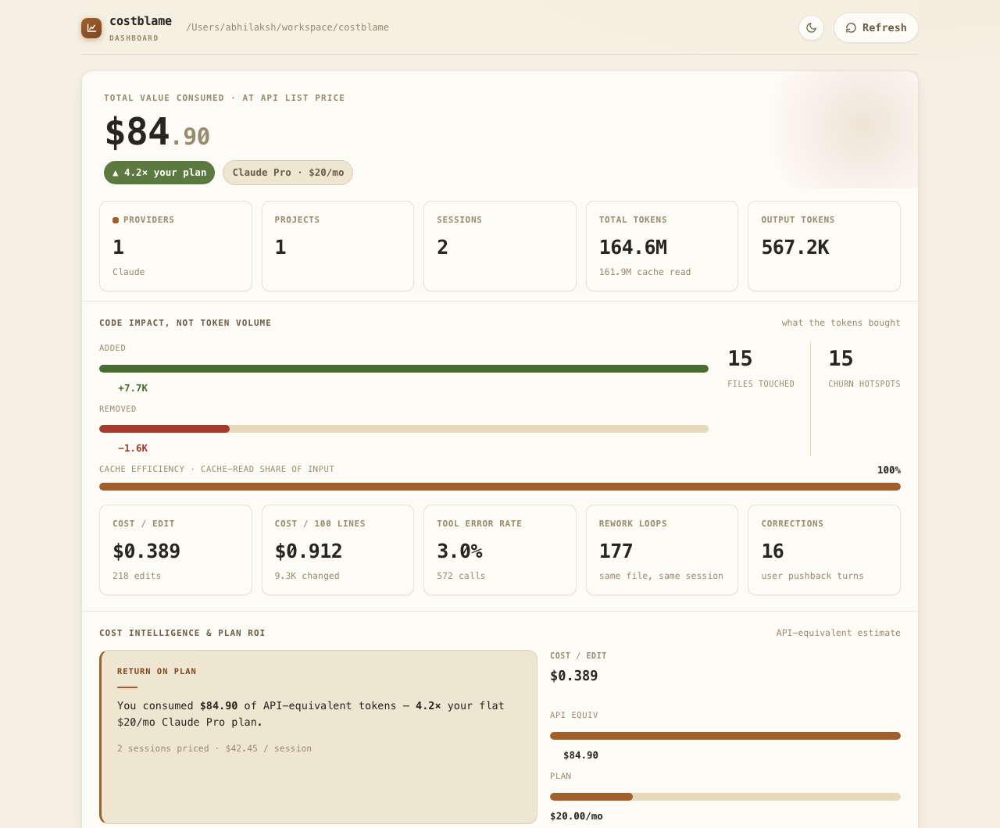

# costblame

[](https://go.dev/)
[](go.mod)
[](LICENSE)

See where your AI coding spend actually goes — **Claude Code, OpenAI Codex, and
Gemini CLI** — broken down by project, by provider, and (for Claude) by git
branch. Everything runs locally: it reads the session logs already sitting on
your machine, and nothing leaves it.

```
BRANCH   INPUT  OUTPUT  CACHE WR  CACHE RD  COST   SESSIONS  DURATION
feature  6966   21263   660502    3621888   $6.51  1         9m
main     1204    3891    120340    880210    $1.42  2         14m
TOTAL    8170   25154   780842   4502098    $7.93
```

The `COST` column is an **estimate at API list price** — useful for comparing
projects and spotting trends, not a literal invoice (most people run these
tools on a flat-rate subscription, not pay-as-you-go). See
[ARCHITECTURE.md](ARCHITECTURE.md) for exactly what it means and how it's
calculated.

## Install

Go stdlib only, no dependencies.

**Quickest — prebuilt binary via curl** (macOS/Linux; installs to `~/.local/bin`):

```sh
curl -fsSL https://raw.githubusercontent.com/abhilaksh-arora/costblame/main/install.sh | sh
```

**From a clone:**

```sh
git clone https://github.com/abhilaksh-arora/costblame.git
cd costblame
make install          # builds + installs to ~/.local/bin (must be on PATH)
```

Or straight from GitHub (installs to `$(go env GOPATH)/bin`):

```sh
go install github.com/abhilaksh-arora/costblame@latest
```

Remove it anytime with `costblame uninstall` (or `make uninstall`).



## Use

There's nothing to set up per-project and nothing gets "saved" anywhere —
costblame just reads the session logs Claude Code / Codex / Gemini already
write locally and recomputes on every run. `sync` is the command that shows
that:

```sh
costblame init         # one-time: pick your plan, or skip
costblame sync          # spend for the repo you're standing in
costblame sync --all    # spend across every project you've used it in
costblame serve          # web dashboard → http://127.0.0.1:7777 (pass --all for every project)
```

Running `costblame` with no arguments prints a short reminder of these instead
of a report — use `sync` for that. `--repo` also repeats, so you can scope to
an exact handful of projects instead of one or "every project you own":

```sh
costblame sync --repo ~/work/api --repo ~/work/web   # just these two, nothing else
costblame serve --repo ~/work/api --repo ~/work/web  # same, in the dashboard
```

Or exclude a project permanently instead of picking the others every time —
run this once, from inside it:

```sh
costblame ignore      # this repo drops out of --all / sync --all / serve --all
costblame unignore    # undo
costblame ignored     # what's currently excluded
```

An ignored repo still shows up if you ask for it directly with `--repo`; it's
only left out of the "everything" views.

A few more commands and flags:

```sh
costblame sync --all --by day    # spend bucketed by day or week, across every project
costblame sync --json            # full report as JSON, for piping into other tools
costblame sync --pricing rates.json   # override the built-in pricing table
costblame serve --all            # dashboard across every project, not just this one
costblame update                 # update to the latest release
costblame version                # print the installed version
costblame help                   # full command + flag reference
```

## Dashboard

`costblame serve` opens a local, offline dashboard: cost vs. your plan,
spend by provider and by project, a daily trend, and (for Claude) code-impact
stats — lines changed, most-touched files, tool error rate. It binds to
`127.0.0.1` only and fetches nothing external.

## Learn more

[ARCHITECTURE.md](ARCHITECTURE.md) has the deeper reference: what the dollar
figure really means, how pricing and caching are calculated, accuracy caveats,
and how the code is laid out.

## License

[MIT](LICENSE)
